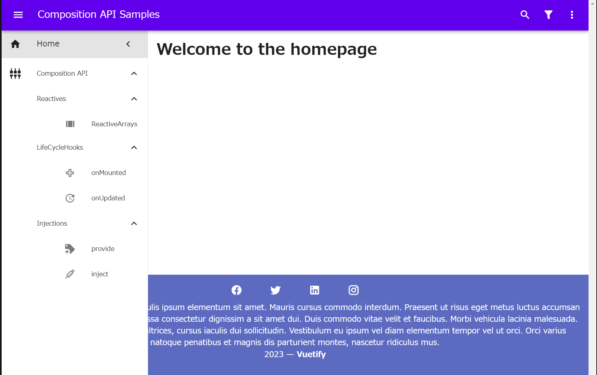

# Nuxt3, Vuetify3で基本的なレイアウトを構成

## vuetify3導入 (mdi/font, sass)

    ```
    $ yarn add -D vuetify@next @mdi/font sass
    ```
    
## vuetify3設定
* plugins/vuetify.ts

    ```
    import { createVuetify } from "vuetify";
    import * as components from "vuetify/components";
    import * as directives from "vuetify/directives";

    export default defineNuxtPlugin((nuxtApp) => {
    const vuetify = createVuetify({
        components,
        directives,
    });

    nuxtApp.vueApp.use(vuetify);
    });
    ```

* nuxt.config.ts
    ```
    // https://nuxt.com/docs/api/configuration/nuxt-config
    export default defineNuxtConfig({
    ssr: false,
    css: ["vuetify/styles", "@mdi/font/css/materialdesignicons.css"],
    })
    ``` 
    
## デフォルトレイアウトによる基本レイアウト構築
* レイアウト目標
    * ヘッダー
        * アプリケーションバー
        * 左ナビゲーションドローワー
            * railによるメニュー縮小
            * ３階層のメニュー
    * フッター
    * メインコンテンツ 



    
* レイアウト定義
    * layouts/default.vue

    ```
    <template>
    <v-app>
        <AppHeader />
        <v-main>
        <v-container>
            <slot />
        </v-container>
        </v-main>
        <AppFooter />
    </v-app>
    </template>  
    ```
    
* ヘッダーコンポーネント
    * components/AppHeader.vue
    * ヘッダーとドローワーメニューを定義
        * ヘッダー、ドローワーメニューで変数drawerを共有するため、同一コンポーネントに実装。

    ```
    <template>
    <v-app-bar color="primary" prominent>
        <v-app-bar-nav-icon
        variant="text"
        @click.stop="drawer = !drawer"
        ></v-app-bar-nav-icon>
        <v-toolbar-title>Composition API Samples</v-toolbar-title>
        <v-spacer></v-spacer>
        <v-btn variant="text" icon="mdi-magnify"></v-btn>
        <v-btn variant="text" icon="mdi-filter"></v-btn>
        <v-btn variant="text" icon="mdi-dots-vertical"></v-btn>
    </v-app-bar>
    <v-navigation-drawer
        v-model="drawer"
        :rail="rail"
        width="300"
        permanent
        @click="rail = false"
    >
        <v-list-item prepend-icon="mdi-home" title="Home" to="/">
        <template v-slot:append>
            <v-btn
            variant="text"
            icon="mdi-chevron-left"
            @click.stop="rail = !rail"
            ></v-btn>
        </template>
        </v-list-item>
        <v-divider></v-divider>
        <v-list v-model:opened="open" nav>
        <v-list-group value="Composition API">
            <template v-slot:activator="{ props }">
            <v-list-item
                v-bind="props"
                prepend-icon="mdi-video-input-component"
                title="Composition API"
            ></v-list-item>
            </template>
            <v-list-group value="Reactives">
            <template v-slot:activator="{ props }">
                <v-list-item v-bind="props" title="Reactives"></v-list-item>
            </template>
            <v-list-item
                v-for="([title, icon, to], i) in reactives"
                :key="i"
                :title="title"
                :prepend-icon="icon"
                :value="title"
                :to="to"
            ></v-list-item>
            </v-list-group>
            <v-list-group value="LifeCycleHooks">
            <template v-slot:activator="{ props }">
                <v-list-item v-bind="props" title="LifeCycleHooks"></v-list-item>
            </template>
            <v-list-item
                v-for="([title, icon], i) in lifecyclehooks"
                :key="i"
                :value="title"
                :title="title"
                :prepend-icon="icon"
            ></v-list-item>
            </v-list-group>
            <v-list-group value="Injections">
            <template v-slot:activator="{ props }">
                <v-list-item v-bind="props" title="Injections"></v-list-item>
            </template>
            <v-list-item
                v-for="([title, icon], i) in injections"
                :key="i"
                :value="title"
                :title="title"
                :prepend-icon="icon"
            ></v-list-item>
            </v-list-group>
        </v-list-group>
        </v-list>
    </v-navigation-drawer>
    </template>
    <script setup>
    import { ref } from "vue";
    const drawer = ref(true);
    const rail = ref(true);
    const open = ref(["Composition API"]);
    const reactives = ref([
    ["ReactiveArrays", "mdi-view-array", "/reactives/arrays"],
    ]);
    const lifecyclehooks = ref([
    ["onMounted", "mdi-plus-outline"],
    ["onUpdated", "mdi-update"],
    ]);
    const injections = ref([
    ["provide", "mdi-tag-plus"],
    ["inject", "mdi-needle"],
    ]);
    </script>
    ```
    
* フッターコンポーネント
    * components/AppFooter.vue 

    ```
    <template>
    <v-footer class="bg-indigo-lighten-1 text-center d-flex flex-column">
        <div>
        <v-btn
            v-for="icon in icons"
            :key="icon"
            class="mx-4"
            :icon="icon"
            variant="text"
        ></v-btn>
        </div>

        <div class="pt-0">
        Phasellus feugiat arcu sapien, et iaculis ipsum elementum sit amet. Mauris
        cursus commodo interdum. Praesent ut risus eget metus luctus accumsan id
        ultrices nunc. Sed at orci sed massa consectetur dignissim a sit amet dui.
        Duis commodo vitae velit et faucibus. Morbi vehicula lacinia malesuada.
        Nulla placerat augue vel ipsum ultrices, cursus iaculis dui sollicitudin.
        Vestibulum eu ipsum vel diam elementum tempor vel ut orci. Orci varius
        natoque penatibus et magnis dis parturient montes, nascetur ridiculus mus.
        </div>

        <v-divider></v-divider>

        <div>{{ new Date().getFullYear() }} — <strong>Vuetify</strong></div>
    </v-footer>
    </template>
    <script>
    export default {
    data: () => ({
        icons: ["mdi-facebook", "mdi-twitter", "mdi-linkedin", "mdi-instagram"],
    }),
    };
    </script>
    ```


* メインコンテンツ
    * pages/index.vue

    ```
    <template>
        <div>
            <h1>Welcome to the homepage</h1>
        </div>
    </template>
    ```    


## CodeSandBoxへのリンク
* [codesandbox:nuxt3-vuetify3-layout](https://codesandbox.io/p/sandbox/nuxt3-vuetify3-layout-72jwjc?embed=1)

